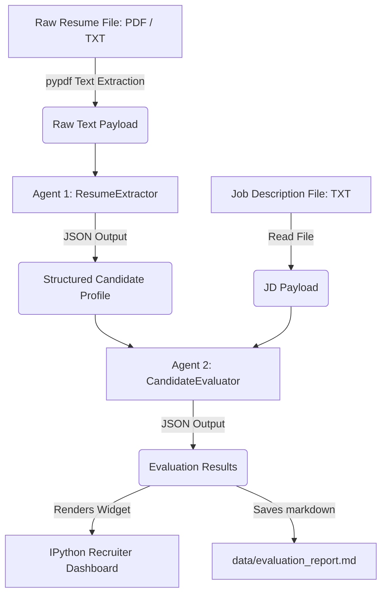

# ResuMatch AI: Multi-Agent HR Pipeline

ResuMatch AI is an automated, code-first recruitment screening pipeline built using the **Google Agent Development Kit (ADK)** and Google Gemini models. It orchestrates a team of specialized AI agents to extract structured data from resumes (PDFs or plain text), evaluate candidates against a target Job Description (JD), compute a match scorecard, and generate customized technical interview questions.

The codebase is compiled into a single, fully-documented, and interactive Jupyter Notebook (`resumatch_ai.ipynb`) designed to run seamlessly in local IDEs (VS Code/Jupyter) or as a public notebook on **Kaggle**.

---

## 🏗️ Architecture & Flow



1. **ResumeExtractor Agent:** Parses raw resume text and formats it into a standardized JSON structure containing contact info, total years of experience, top roles, and structured technical skillsets.
2. **CandidateEvaluator Agent:** Semantically aligns the candidate's skills and experience against the target Job Description. It outputs a match score (0-100%), a requirements alignment matrix, and 3 custom interview questions focusing on candidate profile gaps.
3. **Dashboard & Report Generator:** Renders a visual HTML/CSS scorecard directly inside the notebook and automatically exports a standalone Markdown report file to `data/evaluation_report.md`.

---

## 📂 Project Structure

```
├── data/
│   ├── job_descriptions/
│   │   └── backend_engineer.txt       # Target Job Description
│   └── resumes/
│       ├── candidate_alice.txt        # Mock Candidate (Strong Match)
│       └── candidate_bob.txt          # Mock Candidate (Weak Match)
├── secrets/
│   └── gemini_key.txt                 # Local Gemini API Key (Git-ignored)
├── .gitignore                         # Configured to prevent key leaks
├── README.md                          # Project documentation
└── resumatch_ai.ipynb                 # Core Jupyter Notebook
```

---

## 🛠️ Installation & Setup

### 1. Clone the Repository
```bash
git clone https://github.com/SKSingh655/ResuMatch-AI-Multi-Agent-HR-Pipeline.git
cd ResuMatch-AI-Multi-Agent-HR-Pipeline
```

### 2. Set Up Your API Key (Choose One)

#### Local Setup (Recommended)
Create a file named `gemini_key.txt` inside the `secrets/` directory and paste your API key there:
```bash
mkdir secrets
echo "YOUR_GEMINI_API_KEY" > secrets/gemini_key.txt
```
*Note: The `secrets/` folder is pre-configured in `.gitignore` and will never be committed to your repository.*

#### Environment Variable Setup
Alternatively, set the key in your terminal context:
```bash
# Windows PowerShell
$env:GEMINI_API_KEY="your_key_here"

# Windows Command Prompt
set GEMINI_API_KEY=your_key_here

# Linux/macOS
export GEMINI_API_KEY="your_key_here"
```

---

## 🚀 How to Run

### Local Run
1. Open the folder in VS Code or Jupyter Notebooks.
2. Open `resumatch_ai.ipynb`.
3. Run all cells. 
4. The notebook will install required dependencies (`google-adk`, `pypdf`, `pandas`, `ipywidgets`) automatically, extract text, call the agents, and show the dashboard.

### Kaggle Run
1. Create a new notebook on Kaggle.
2. Go to **File -> Upload Notebook** and upload `resumatch_ai.ipynb`.
3. In the Kaggle sidebar under **Add-ons -> Secrets**, add a secret with the label `GEMINI_API_KEY` and your key as the value.
4. Run the notebook. It will detect the Kaggle environment and securely load your API key without exposing it.

---

## 🛡️ License
Distributed under the Apache 2.0 License. See Google ADK license guidelines for further details.
