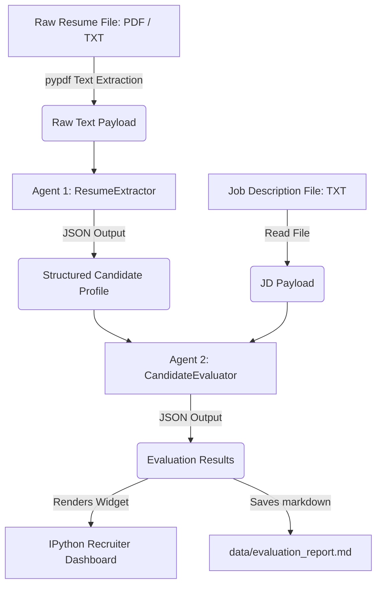

# ResuMatch AI: Multi-Agent HR Pipeline

ResuMatch AI is an automated, code-first recruitment screening pipeline built using the **Google Agent Development Kit (ADK)** and Google Gemini models. It orchestrates a team of specialized AI agents to extract structured data from resumes (PDFs or plain text), evaluate candidates against a target Job Description (JD), compute a match scorecard, and generate customized technical interview questions.

The codebase is compiled into a single, fully-documented, and interactive Jupyter Notebook (`resumatch_ai.ipynb`) designed to run seamlessly in local IDEs (VS Code/Jupyter) or as a public notebook on **Kaggle**.

---

## 🏗️ Architecture & Flow



1. **ResumeExtractor Agent:** Parses raw resume text and formats it into a standardized JSON structure containing contact info, total years of experience, top roles, and structured technical skillsets.
2. **CandidateEvaluator Agent:** Semantically aligns the candidate's skills and experience against the target Job Description. It outputs a match score (0-100%), a requirements alignment matrix, and 3 custom interview questions focusing on candidate profile gaps.
3. **Dashboard & Report Generator:** Renders a visual HTML/CSS scorecard directly inside the notebook and automatically exports a standalone Markdown report file to `data/evaluation_report.md`.

---

## 📂 Project Structure

```
├── data/
│   ├── job_descriptions/
│   │   └── backend_engineer.txt       # Target Job Description
│   └── resumes/
│       ├── SKSResume.pdf              # Target PDF candidate resume
│       ├── candidate_alice.txt        # Mock Candidate (Strong Match)
│       └── candidate_bob.txt          # Mock Candidate (Weak Match)
├── secrets/
│   └── gemini_key.txt                 # Local Gemini API Key (Git-ignored)
├── .gitignore                         # Configured to exclude environments and outputs
├── README.md                          # Project documentation
└── resumatch_ai.ipynb                 # Core Jupyter Notebook
```

---

## 🛠️ API Key Configuration

To run the pipeline, the notebook requires a Gemini API Key. You can provide it in one of the following ways:

### Method 1: Local Secrets Folder (Highly Recommended for local runs)
Create a directory named `secrets` at the root of the project and create a file named `gemini_key.txt` inside it. Paste your API key in this file:
```bash
mkdir secrets
echo "YOUR_GEMINI_API_KEY" > secrets/gemini_key.txt
```
*Note: The `secrets/` folder is pre-configured in `.gitignore` and will never be committed to your repository.*

### Method 2: Set as an Environment Variable
Alternatively, set the key in your terminal context before starting the notebook server:
```bash
# Windows PowerShell
$env:GEMINI_API_KEY="your_key_here"

# Windows Command Prompt
set GEMINI_API_KEY=your_key_here

# Linux/macOS
export GEMINI_API_KEY="your_key_here"
```

### Method 3: Manual Interactive Prompt
If the notebook does not detect the environment variable or local secrets file, it will securely prompt you with an interactive text input to paste your key when you execute the cell.

### Method 4: Kaggle Secrets (For Kaggle Cloud Runs)
If running on Kaggle:
1. Go to **Add-ons -> Secrets** in the editor.
2. Add a new secret with the label `GEMINI_API_KEY` and your key as the value.
3. The notebook will automatically authenticate securely using this secret.

---

## 🚀 How to Run Local

1. Clone this repository and open the workspace.
2. Open `resumatch_ai.ipynb` in VS Code or Jupyter Lab.
3. Make sure the notebook kernel is set to your virtual environment (e.g. `Python 3 (ResuMatch AI)`).
4. Run the cells sequentially.

---

## 🛡️ License
Distributed under the Apache 2.0 License. See Google ADK license guidelines for further details.
